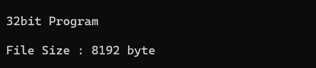
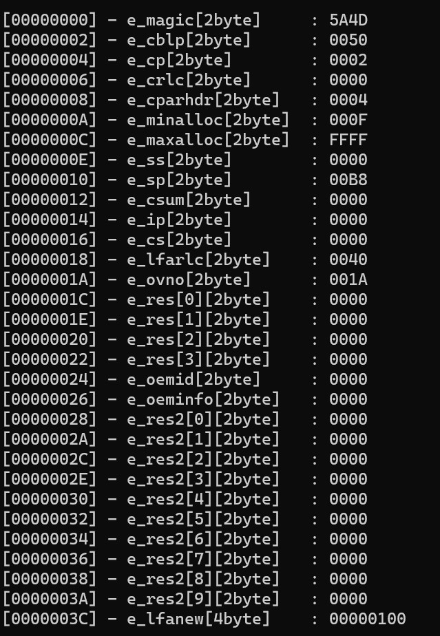
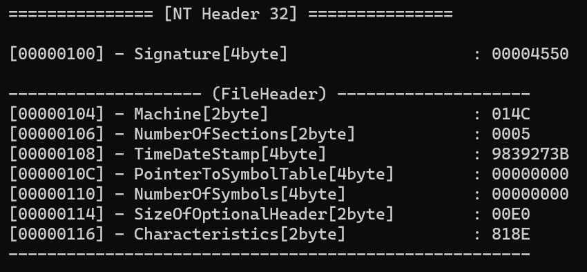
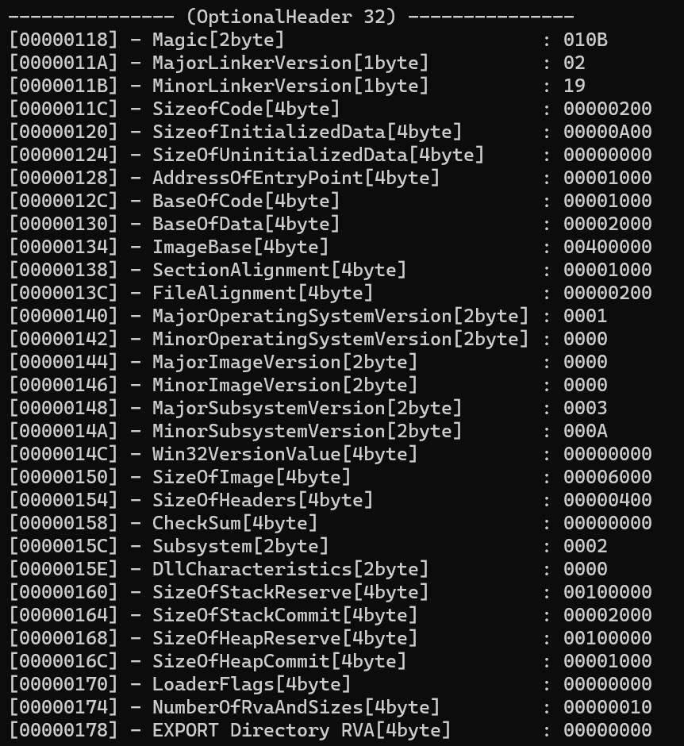
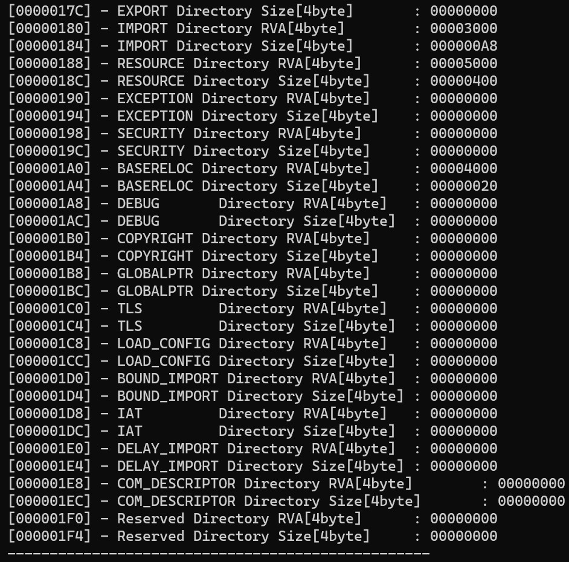
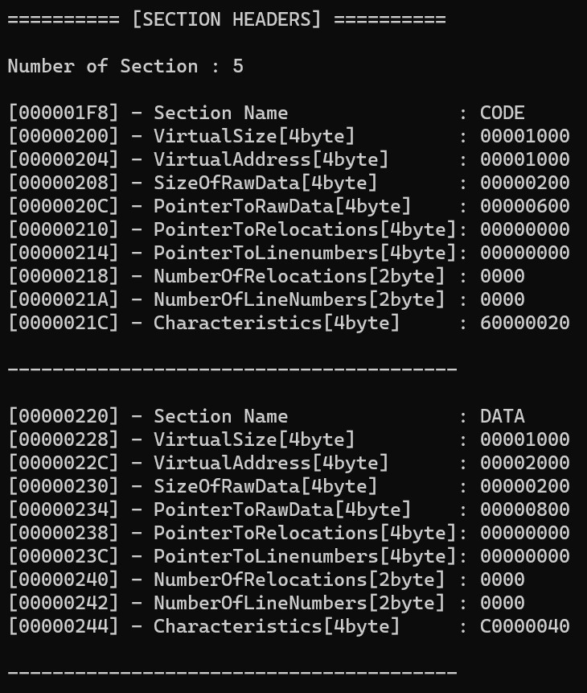
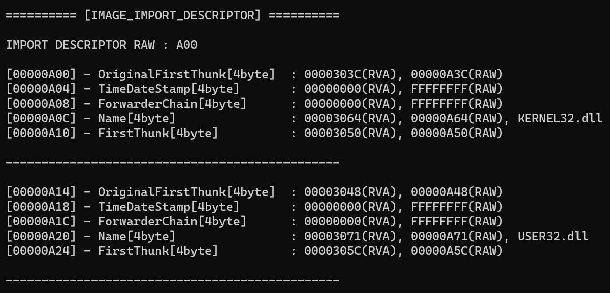
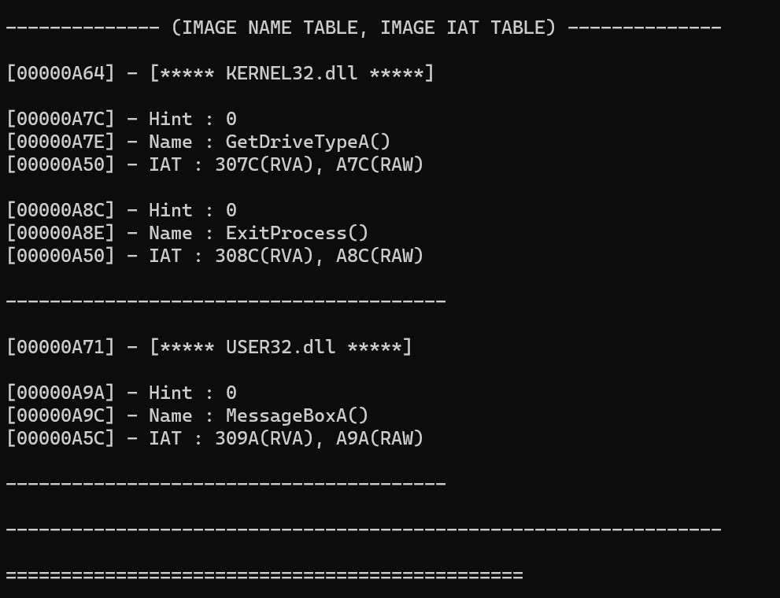
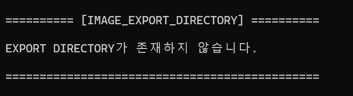
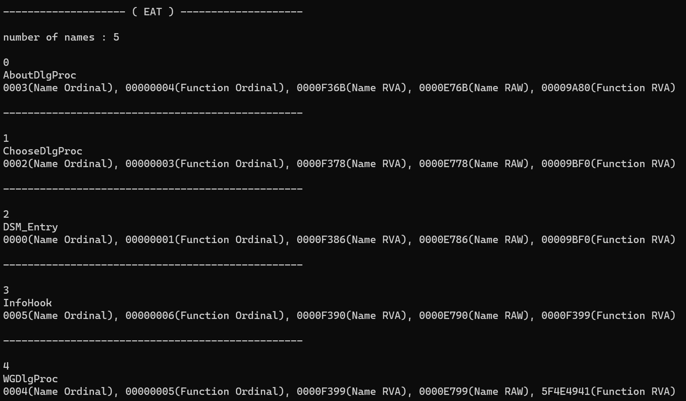

# ISSUE
    - rva_to_raw 함수의 3번째 인자가 기본적으로 DWORD이지만 IAT 부분에서 ULONGLONG으로 받아야 할 때가 있어서
    rva_to_raw_dword와 rva_to_raw_ulonglong 함수로 나눠서 사용하지만 3번째 인자를 void형 pointer로 받아 사용할 수 있지 않을까 한다.

---

# 구조체 순서

→ IMAGE_DOS_HEADER

→ IMAGE_NT_HEADER(IMAGE_FILE_HEADER, IMAGE_OPTIONAL_HEADER)

    ⇒ IMAGE_OPTIONAL_HEADER → IMAGE_DATA_DIRECTORY[]

        ⇒ IMAGE_DATA_DIRECTORY[1].VirtualAddress(RVA) → IMAGE_IMPORT_DESCRIPTOR[]

            ⇒ IMAGE_IMPORT_DESCRIPTOR[].OriginalFirstThunk → IMAGE_THUNK_DATA.u1.AddressOfData → IMAGE_IMPORT_BY_NAME(HINT, Function Name)

            ⇒ IMAGE_IMPORT_DESCRIPTOR[].FirstThunk → IMAGE_THUNK_DATA.u1.Function(IAT)

→ IMAGE_SECTION_HEADER

- IMAGE_OPTIONAL_HEADER32, IMAGE_OPTIONAL_HEADER64
- IMAGE_THUNK_DATA32, IMAGE_THUNK_DATA64

---

# Info

## dos header
dos header → e_magic
dos header → e_lfanew

## nt header
nt header → signature
nt header → file header → machine, NumberOfSections, SizeOfOptionalHEader, Characteristics
nt header → optional header → magic, AddressOfEntryPoint, ImageBase, SizeOfimage, SizeOfHeader, Subsystem, NumberOfRvaAndSizes, DataDirectory

## Section header
section header → VirtualSize, VirtualAddress, PointerToRawData, Characteristics

---

# RVA To RAW
1. 각 섹션의 VirtualAddress + VirtualSize 값과 PointerToRawData 값을 구한다.
2. RVA 값이 어떤 섹션의 VirtualAddress 보다 크고 VirtualAddress + VirtualSize 보다 작은지 파악한다.
3. RVA 값이 속하는 섹션의 VirtualAddress와 PointerToRawData를 이용해 아래의 연산을 한다.
```bash
RAW : RVA - VirtualAddress + PointerToRawData
```

---

# GetProcAddress() process

1. AddressOfNames 멤버를 이용해 “함수 이름 배열”로 간다.
2. “함수 이름 배열”은 문자열 주소가 저장되어 있다.
문자열 비교(strcmp)를 통해 원하는 함수 이름을 찾는다.
(이때 배열의 인덱스를 name_index라고 임시로 정한다)
3. AddressOfNameOrdinals 멤버를 이용해 “ordinal 배열”로 간다.
4. “Ordinal 배열”에서 name_index로 해당 ordinal 값을 찾는다.
5. AddressOfFunctions 멤버를 이용해 “함수 주소 배열(EAT)”로 간다.
6. “함수 주소 배열(EAT)”에서 이전에 구한 ordinal을 배열 인덱스로 하여 원하는 함수의 시작 주소를 얻는다.

## tip
    함수 이름 없이 Ordinal로만 Export된 함수의 주소를 찾을 수도 있다.
    해당 Oridinal 값에 IMAGE_EXPORT_DIRECTORY.Base 멤버를 뺀 값을 “함수 주소 배열”의 인덱스로 하여 해당 함수 주소를 찾을 수 있다.

---

# EAT 부분 알고리즘

    1. EXPORT 함수 이름들이 적힌 RAW 주소 부분을 구한다.
    (EXPORT하는 라이브러리 이름 뒤에부터가 시작 부분이다.)

    2. IMAGE_EXPORT_DIRECTORY 구조체에서 AddressOfNames의 값(RVA)을 RAW로 바꾸고 해당 RAW 위치로 가보면
    4byte RVA 값들이 배열되어 있는데 해당 RVA 값들을 RAW로 바꾼 값에 위치한 문자열과
    1번에서 구한 RAW 주소에 위치한 문자열을 strcmp로 비교하여 맞을 때까지 반복문을 돌려 name_index를 가져온다.

    3. name_index를 성공적으로 가져왔다면 IMAGE_EXPORT_DIRECTORY 구조체에서 AddressOfNameOrdinals의 값(RVA)을
    RAW로 바꾸고 해당 위치로부터 name_index * 2 만큼 떨어진 위치에 있는 값인 ordinal을 구한다.
    (즉, AddfressOfNameOrdinals[name_index])
    
    4. ordinal을 성공적으로 가져왔다면 IMAGE_EXPORT_DIRECTORY 구조체에서 AddressOfFunctions의 값(RVA)을
    RAW로 바꾸고 해당 위치로부터 ordinal * 4 만큼 떨어진 위치에 있는 값인 EXPORT 함수의 주소(RVA)를 구한다.

    5. EXPORT 함수의 주소(RVA)를 구했다면 반복문으로 AddressOfFunctions의 주소(RAW)부터 4byte씩 이동하며 값을 읽어 EXPORT 함수의 주소(RVA)와 일치한지 검사하는 방법으로 Function index를 구한다.

    6. 구한 값들 name_index, name_ordinal, name RVA, name RAW, Function_index, Function_RVA을 출력한다.

---

# images




















---